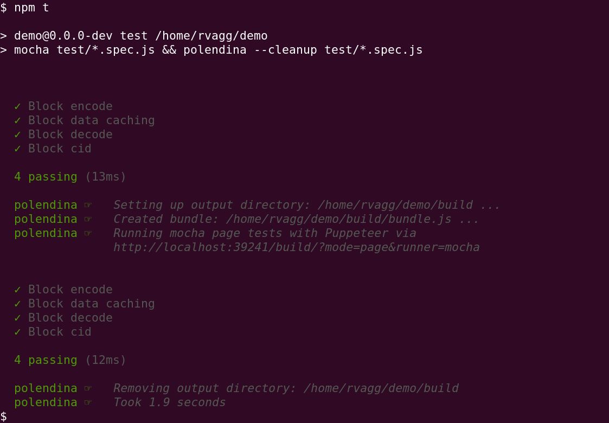

# polendina

**Non-UI browser testing for JavaScript libraries from the command-line**

> At the words, the door opened and a dapper little old man came in. His name was Geppetto, but to the boys of the neighborhood he was Polendina, on account of the wig he always wore which was just the color of yellow corn.
>
> Geppetto had a very bad temper. Woe to the one who called him Polendina! He became as wild as a beast and no one could soothe him.

[](https://github.com/rvagg/polendina/actions/workflows/test-and-release.yml)

[](https://nodei.co/npm/polendina/)

* [What and why?](#what-and-why)
* [Usage](#usage)
  * [Options](#options)
* [Examples](#examples)
* [Test runners](#test-runners)
  * [Mocha](#mocha)
  * [Tape](#tape)
  * [bare-sync](#bare-sync)
  * [bare-async](#bare-async)
* [TypeScript support (and other Webpack extensions)](#typescript-support-and-other-webpack-extensions)
* [polendina-node: the minimal Node.js test runner](#polendina-node-the-minimal-nodejs-test-runner)
* [Minimising Puppeteer's size](#minimising-puppeteers-size)
  * [Global and npx](#global-and-npx)
* [License and Copyright](#license-and-copyright)

## What and why?

Browser testing _still_ sucks, especially if you just want to make sure your JavaScript libraries work in a browser environment and don't need the UI testing overhead. Thankfully there's [Puppeteer](https://pptr.dev/) that can run headless Chrome with a Node.js API.

**polendina is a frontend to Puppeteer that simplifies the testing pipeline for JavaScript libraries.** A typical use-case is a library that uses a browser-friendly Node.js test runner, such as Mocha but is designed for both Node.js and the browser. polendina can be inserted into npm scripts to run the test suite in a browser environment. `npm test` can then trigger both Node.js _and_ browser tests without dramatically extending execution time.

***Example package.json:***

```json
  "scripts": {
    "lint": "standard",
    "test:node": "mocha tests/test-*.js",
    "test:browser": "polendina --cleanup tests/test-*.js",
    "test": "npm run lint && npm run test:node && npm run test:browser"
  }
```

***Example execution:***

Using `mocha test/*.spec.js && polendina --cleanup test/*.spec.js` as the test script. The first block is natively via Node.js using the Mocha CLI. The second block is within a browser page, using the Mocha browser bundle reporting back to the command-line. Total time for this simple test suite across Node.js and the browser was 2.5 seconds.



Even though polendina is intended for "non-UI" testing, your tests run in a standard browser environment so the UI isn't out of bounds if need it.

## Usage

`polendina <test file list / glob pattern>`

### Options

 * `--runner`, `-r`: The test runner to use (choices: "mocha", "tape", "bare-sync", "bare-async") (default: "mocha")
 * `--output-dir`, `-o`: Location for temporary build resources, if `--cleanup` isn't specified you will need to clean this up yourself (default: "./build")
 * `--page`: Run tests in standard browser page (default: "true")
 * `--worker`: Run tests in a WebWorker (default: "false")
 * `--serviceworker`: Run tests in a ServiceWorker (default: "false")
 * `--stats`: Write webpack-stats.json with bundle; written to the `output-dir` so will be removed if `--cleanup` is specified (default: "false")
 * `--cleanup`: Remove the `output-dir` after execution (default: "false")
 * `--timeout`: Number of seconds to wait before auto-failing the test suite (default: "30")
 * `--webpack-config`: Supply a path to a webpack.config.js to merge into Polendina's Webpack config (use with caution)
 * `--mocha-reporter`: Specify the Mocha reporter if the test runner is Mocha (default: "spec")

## Examples

Run Mocha test suite in Page, a WebWorker and a ServiceWorker, then clean up:

```
polendina --worker --serviceworker --cleanup tests/**/test-*.js
```

Run a Tape test suite in a WebWorker only and write a webpack-stats.json file:

```
polendina --runner=tape --page=false --worker --stats tests/*-test.js
```

Run a bare synchronous test file (tests are executed as soon as the file is loaded with no asynchronous activity), then clean up:

```
polendina --runner=bare-sync test.js
```

## Test runners

Tests should be run with the correct test runner. Tests written against Mocha and Tape require dependencies be loaded in the browser along with some additional utilities to ensure output and test end is properly handled.

### [Mocha](https://mochajs.org)

The default test runner (no need to supply a `--runner`). Standard Mocha reporters may be used, with `--mocha-reporter`. However, the default reporter, `spec` should be preferred as it is the best behaved when printing output. The `tap` reporter is usable. Other reporters, that combine `process.stdout.write()` and `console.log()` have some trouble with interleaved output.

### [Tape](https://ghub.io/tape)

Use with `--runner=tape`

### bare-sync

Use with `--runner=bare-sync`

The `bare-sync` runner assumes either a custom, synchronous test runner is being used, or the fule itself is raw test commands without any asynchronous activity. The `bare-sync` runner will simply load your test files and assume that it will execute sequentially and that the tests are complete when the file has ceased loading.

Test failure for a `bare-sync` runner is signalled by a thrown exception. Most assertion libraries, including the Node.js `assert` module, throw exceptions on failure so may be used.

Simple progress is printed to stdout showing the names of the test files being executed and whether they succeeded or failed. The first failure will end the entire test suite.

**Example `bare-sync` test file:**

```js
const assert = require('assert')
const mymod = require('./')

module.exports = () => {
  assert.strictEquals(typeof mymod.multiply, 'function', 'exports `multiply()`)
  assert.strictEquals(mymod.multiply(10, 5), 50, '`multiply()` works properly)
}
```

### bare-async

Use with `--runner=bare-async`

The `bare-async` runner assumes that test files _export_ the tests in the form of `async` (or `Promise` returning) functions. A test file may either export a single test function, e.g. `module.exports = async () => { ... }`. Alternatively a test file may export multiple test functions, e.g. `module.exports.testOne = async () => { ... }` etc.

Test functions will be run sequentually, waiting for each asynchronous function to complete.

Test failure for a `bare-async` runner is signalled by a thrown exception (or `Promise` rejection). Most assertion libraries, including the Node.js `assert` module, throw exceptions on failure so may be used.

Simple progress is printed to stdout showing both the names of the test files being executed any any constituent test functions within those files if `module.exports` is not a function itself. The first failure will end the entire test suite.

**Example `bare-async` test file:**

```js
const assert = require('assert')
const mymod = require('./')
const mockServer = require('./mock-server')

module.exports.testExport = () => { // non-async function works too as `await` is used
  assert.strictEquals(typeof mymod.fetch, 'function', 'exports `fetch()`)
}
  
module.exports.testFetch = async () => {
  const server = await mockServer()
  const thing = await mymod('localhost', server.port).fetch('/foo/bar/plip')
  assert.strictEquals(thing, { plip: 'plop' }, '`fetch()` works properly)
}

module.exports.testFail = async () => {
  await assert.rejects(async () => {
    await mymod('localhost', '8888').fetch('/foo/bar/plip')
  }, {
    name: 'Error',
    message: 'Could not connect to server'
  })
}
```

## TypeScript support (and other Webpack extensions)

Among other things, the `--webpack-config` option can be used to enable TypeScript support by mixing in the [ts-loader](https://ghub.io/ts-loader) package:

**webpack.config.ts.js**

```js
module.exports = {
    module: {
        rules: [
            {
                test: /\.tsx?$/,
                use: 'ts-loader',
                exclude: /node_modules/
            }
        ]
    }
    resolve: {
        extensions: ['.tsx', '.ts', '.js']
    }
}
```

```sh
$ polendina --cleanup test/*.spec.ts --webpack-config webpack.config.ts.js
```


## `polendina-node`: the minimal Node.js test runner

polendina's `bare-sync` and `bare-async` modes run plain Node.js modules in the browser without the need for a test runner. But if you want to run these types of files in Node.js you may find it difficult to scale when you have many modules.

A `bare-sync` test file is a simple matter of `node file.js` and checking the exit code, but as you increase the number of files, your package.json `"test"` script starts to get out of hand.

A `bare-async` test file requires a custom runner since it uses exported `async` functions. A simple `require('./file')().catch((err) { console.error(err); process.exit(1) })` would suffice for a single function exported on a single file but this obviously doesn't scale well and your before long your test runner will become a beast of its own.

To deal with this, polendina also ships with a `polendina-node` command-line test runner to manage these for you:

* `polendina-node bare-sync <test files..>`: Run synchronous tests using a plain require(file) on each test file, with simple progress reporting.
* `polendina-node bare-async <test files..>`: Run tests by executing exported functions from files as async, with simple progress reporting.

The `bare-sync` runner doesn't use anything exported from the files listed, simply `require()`ing them and checking for `throw`n errors is assumed enough to run them.

The `bare-async` runner will look for `module.exports` as a function or its child properties to be function and will run them as `async` functions (they don't need to actualy be `async` or return a function, they could be exported sync functions). See [bare-async](#bare-async) above for examples.

## Minimising Puppeteer's size

During install, Puppeteer will download a version of Chromium designed to work with it. This can be quite large (200 - 300 Mb depending on platform). This can be avoided, but you should note the following [caveat from the Puppeteer folks](https://github.com/puppeteer/puppeteer#q-why-doesnt-puppeteer-vxxx-work-with-chromium-vyyy):

> We see Puppeteer as an indivisible entity with Chromium. Each version of Puppeteer bundles a specific version of Chromium – the only version it is guaranteed to work with.

If you are willing to own this risk, you could install a Canary / Unstable version of Chrome on your system and set the following environment variables in your `~/.profile` (or similar):

```sh
export PUPPETEER_SKIP_CHROMIUM_DOWNLOAD=true
# path to Chrome Canary / Chromium Unstable
export PUPPETEER_EXECUTABLE_PATH="/usr/bin/google-chrome-unstable"
# on macOS you could use: "/Applications/Google Chrome Canary.app/Contents/MacOS/Google Chrome Canary"
```

The first environment variable will tell Puppeteer to not bother downloading its own Chromium, and the second tells it which executable to use instead.

### Global and `npx`

Running polendina with npm's [`npx`](https://github.com/npm/npx) tool (i.e. run as `npx polendina ...`) will avoid bloating your node_modules directories. Instead, `npx` will install a copy in your npm cache and run it from there. This can be handy if you have multiple projects using polendina.

If you install polendina as a global (`npm install polendina -g`) then `npx` will even find it from there, avoiding the need to install a copy in the npm cache and you get a `polendina` executable as a bonus.

## License and Copyright

Copyright 2019 Rod Vagg

Licensed under the Apache License, Version 2.0 (the "License"); you may not use this file except in compliance with the License. You may obtain a copy of the License at http://www.apache.org/licenses/LICENSE-2.0

Unless required by applicable law or agreed to in writing, software distributed under the License is distributed on an "AS IS" BASIS, WITHOUT WARRANTIES OR CONDITIONS OF ANY KIND, either express or implied. See the License for the specific language governing permissions and limitations under the License.
